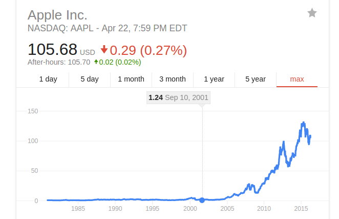
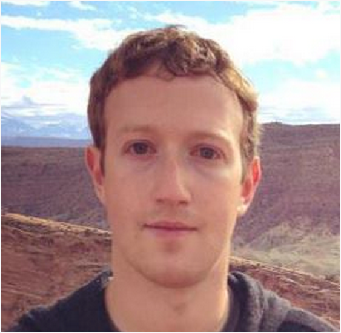

title: The Millennial Deep State
author:
  name: Patrick Steadman
  twitter: ptsteadman
  url: https://ptsteadman.com
output: index.html
controls: true
style: basic.css

--

# THE MILLENNIAL DEEP STATE
## Moving fast and breaking things.

--

### What is the Deep State?

- The term 'Deep State' was first used to refer to secret anti-democratic
  coalitions in Turkey unmasked in the [1996 Susurluk
  incident](https://en.wikipedia.org/wiki/Susurluk_scandal), a botched **'car
  crash' assassination**.

--

### What is the Deep State?

- The term is now also used to describe any **semi-secret, unelected, elite group of
  people** with power over world affairs.

- What's the goal of the Deep State?  To preserve the hidden power of the Deep State.  

- The Deep State is tacit, not explicit.  **You might be a deep state actor without even
  knowing it.**

-- 

### What does the Deep State look like?

**The Baby Boomer Deep State**

--

### Anatomy of the Boomer Deep State

**The Baby Boomer Deep State**

- Three letter agencies: CIA, FBI, NSA, ONI
- Crime families and 'the Cabal': Gambino, Sinaloa, Dulles, Bush
- Military-Industrial: Manhattan Project, Area 51, Roswell

--

### Deep Events

**'Deep Events': the Footprints of the Deep State**

- Structural, intentional Deep Events: Watergate Coup, Kennedy Assassination,
  Lockerbie bombing, Gulf War
- Low level, accidental deep events: assassinations, leaks, surveillance,
  financial control

--

### The Birth of the Millennial Deep State
** The Deep State in a post Cold War world **

In the 90s, despite attempts at destabilizing the world with the Gulf War and
Asian Financial crisis , **the Cabal was losing control.**

The Internet, originally funded by ARPA in the 1960s, was also becoming a
problem.

--

### The Birth of the Millennial Deep State
**The Late 90's 'dot-com' Bubble**

What we're told: *irrational exuberance*

What we're told: the technology *wasn't ready yet*

The reality: **massive sabatoge of tech industry by the Deep State**

--

### Dot-Com Bubble Companies

Iridium Satellite Constellation -> iPhone

Pixelon -> YouTube

VA Linux -> Amazon Web Services

theGlobe -> (the) Facebook

Kozmo -> Uber

Flooz -> Bitcoin, Ethereum

GovWorks -> Palantir

--

### IPOs and Public Trading 

All of these companies were being traded by citizens online, creating wealth for
the middle class.

The Deep State  **attacked the tech industry** by fanning tensions with China,
discrediting honest startups, publicizing the Y2k 'bug'...

Finally, an anti-trust case against Microsoft eventually "popped" a manufactured
"bubble" on March 20th, 2000.

--

### The Deep State and the Internet

--

### Revenge of the Geeks

Technocrats within the Deep State were angry about being **stabbed in the back**.

They were sick of the 'Cabal' that put an incompetent Bush scion in power.  

**The technocrats decided to take action.**

--

### The September 11th Coup

9/11 was orchestrated by technocrats within the Deep State in order to take
power from 'the Cabal'.

Deep State technocrats transformed Arab extremists into a decentralized
network of terror cells.

**The War on Terror would require unprecendented information technology programs
and the spectacle would create a desire for mass social media.**

--

### Who Led the September 11th Coup?

What individual could plan such a massive undertaking with **absolute secrecy**?
Who had the **attention to detail**?

Who had the resources, network and necessary **Middle East connections**?

Who was willing to **transform the culture of an entire country**?

-- 

### The Leader of the September 11th Coup

Led by Steve Jobs.

--

### Steve Jobs Middle East Connection
Jobs' biological father was Abdulfattah Jandali, a wealthy Arab nationalist in exile.

--

### Did It Work? 
** The Cabal backed down.**

--

### Did It Work?
** Technocrats took control of the Deep State. **

--

### Did It Work?
** Constant survelliance took the place of intimidation and violence, most of the time. **

- PRISM
- HBgary "sockpuppets" and "astroturfing"
- Palantir, Stratfor
- Hardware backdoors, IoT, JavaScript
- Drones

--

### What About Today?
** The Deep State is flexible and seductive. **

Many ambitious young people make faustian deals with the Deep State in order to
achieve success.

Others are Deep State plants from birth.

--

### What About Today?

--

### What Happens if You Expose the Deep State?
**Most of the time, nothing.**

The Deep State doesn't have formal meetings or titles.

It doesn't have a symbol or crest.

It doesn't have a membership card.

--
### Does the Millennial Deep State Kill People?
**Example: Michael Hastings**

Covered Iraq War, Occupy Wall Street, PRISM.

About 15 hours before dying in a fiery car crash at about 4:30 a.m. in L.A., he
sent an email to several colleagues that said the FBI was investigating him and
he was "onto a big story."

--

### Does the Millennial Deep State Kill People?

--

### Does the Millennial Deep State Kill People?
"consistent with a car cyber attack"  

--

# Good Luck, Stay Safe

